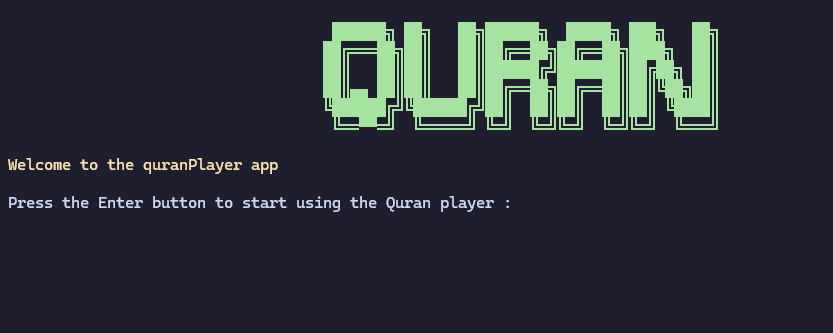

# quranPlayer


A lightweight Quran player built with Python, operating through a terminal and supporting downloading and streaming the Quran from MP3Quran servers.



## Features 

- Listen to Quran recitations directly from the terminal
- Works on Linux and Windows
- Internet streaming and downloading
- Supports multiple famous Quran reciters
- Lightweight and works well on devices with limited resources

## Supported Reciters

* Abdul Basit Abdus Samad
* Mahmoud Khalil Al-Husary
* Mohamed Siddiq Al-Minshawi
* Mishary Rashid Alafasy
* Maher Al-Muaiqly
* Yasser Al-Dosari
* Saad Al-Ghamdi
* Saud Al-Shuraim
* Ahmed Al-Ajmi
* Abdul Rahman Al-Sudais
* Abu Bakr Al-Shatri
* Muhammad Ayyoub
* Nasser Al-Qatami
* Ali Al-Hudhaifi
* Khalifa Al-Tunaiji

## Requirements

* Python 3.10
* miniaudio

## Installation

```bash
git clone https://github.com/MohssineX/quranPlayer.git
```

and

```bash
cd quranPlayer
```

### Install dependencies :

```bash
pip install -r requirements.txt
```

Or

```bash
pip install miniaudio
```

## Usage

Run the program :

```bash
python quranPlayer.py
```

If your system uses `python3` :

```bash
python3 quranPlayer.py
```
## How It Works

1. Start the program
2. Choose whether to listen online or download an audio file
3. Select your preferred Quran reciter
4. Enter a Surah number (1–114)
5. The application connects to MP3Quran servers
6. The selected Surah is streamed or downloaded
7. Choose to restart the application or quit

---

## License

This project is licensed under the **[GNU General Public License v3.0](https://www.gnu.org/licenses/gpl-3.0.html)**

---

## Acknowledgments

Quran audio are provided by the MP3Quran network.

---

## 🐱 Special Thanks

A special thanks to mimi — the legendary, the great, the gentle cat.

---

### If you like it, give it a star :)

