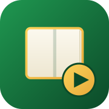
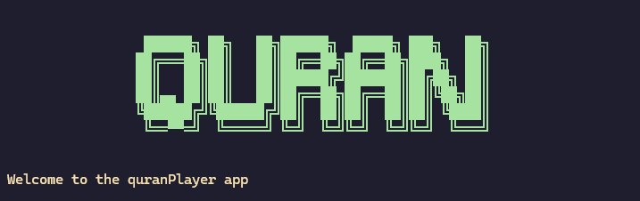
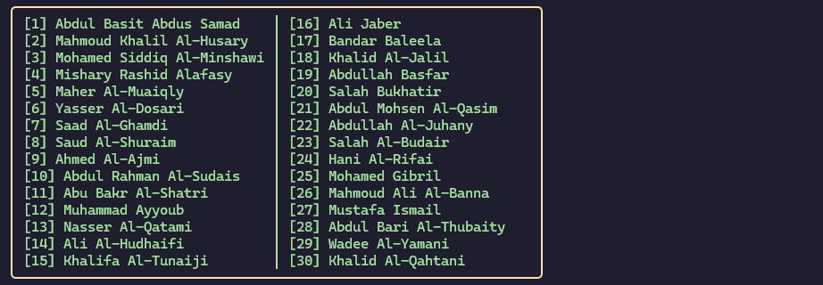

# quranPlayer


<div align="center">



</div>

A lightweight Quran player built with Python that runs in the terminal and supports streaming and downloading Quran recitations from MP3Quran servers.




> [!NOTE]
> 
> Currently, the **quranPlayer** project is still in **Beta**, so you may encounter errors, unexpected behavior, or unstable features.
>
> **Feel free to report any bugs or issues.**

## Features 

- Listen to Quran recitations directly from the terminal
- Internet streaming and downloading
- Supports multiple famous Quran reciters
- Lightweight and works well on devices with limited resources

## Supported Reciters

* Abdul Basit Abdus Samad
* Mahmoud Khalil Al-Husary
* Mohamed Siddiq Al-Minshawi
* Mishary Rashid Alafasy
* Maher Al-Muaiqly
* Yasser Al-Dosari
* Saad Al-Ghamdi
* Saud Al-Shuraim
* Ahmed Al-Ajmi
* Abdul Rahman Al-Sudais
* Abu Bakr Al-Shatri
* Muhammad Ayyoub
* Nasser Al-Qatami
* Ali Al-Hudhaifi
* Khalifa Al-Tunaiji
* Ali Jaber
* Bandar Baleela
* Khalid Al-Jalil
* Abdullah Basfar
* Salah Bukhatir
* Abdul Mohsen Al-Qasim
* Abdullah Al-Juhany
* Salah Al-Budair
* Hani Al-Rifai
* Mohamed Gibril
* Mahmoud Ali Al-Banna
* Mustafa Ismail
* Abdul Bari Al-Thubaity
* Wadee Al-Yamani
* Khalid Al-Qahtani

## Supported Platforms

- Windows
- Linux
- macOS

## Requirements

* Python 3.10 or later
* miniaudio
* Internet connection
* Terminal with ANSI escape sequence support

## Installation

### Clone the repository :

```bash
git clone https://github.com/MohssineX/quranPlayer.git
cd quranPlayer
```

### Install dependencies :

```bash
pip install -r requirements.txt
```

Or

```bash
pip install miniaudio
```

## Usage

Run the program :

```bash
cd src
```

```bash
python main.py
```

If your system uses `python3` :

```bash
python3 main.py
```
---

## License

This project is licensed under the **[GNU General Public License v3.0](https://www.gnu.org/licenses/gpl-3.0.html)**

---

## Acknowledgments

Recitations are streamed and downloaded from the MP3Quran network (mp3quran.net).

---

## Special Thanks 🐱

Special thanks to **Mimi**, the legendary, great, and gentle cat.

---

### If you like it, give it a star :)
